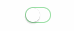

CSS3 UISwitch
=============

[](https://www.npmjs.com/package/uiswitch)
[](https://www.npmjs.com/package/uiswitch)

A pretty sweet and pure CSS3 iOS 7 [UISwitch](https://developer.apple.com/library/ios/documentation/uikit/reference/uiswitch_class/Reference/Reference.html).



#### [See it in action!](http://codepen.io/cbp/pen/FLdjI)

## Grab it

- npm

```
npm install uiswitch
```

- [Bower](http://bower.io/)

```
bower install uiswitch
```

## Use it

#### CSS

The switch is very easy to customize. Using plain vanilla CSS it's just a matter of subclassing. Start styling your custom switch

```css
/* Active Background Tint (when pressed and hold) */
.custom {
  background-color: #eadcbc;
}

/* Background Tint */
.custom::before {
  background-color: #f7f2e5;
}

/* Knob Tint */
.custom::after {
  background: #fff3a6;
}

/* Checked background tint */
.custom:checked {
  background-color: #ffca3f; /* fallback */
  background-image: linear-gradient(
    -180deg,
    #ffca3f 0%, /* top */
    #feca40 100% /* bottom */
  );
}
```

and your HTML would be something like this

```html
  <input type="checkbox" class="uiswitch custom">
```

#### Sass

It's even easier with Sass. The class `.uiswitch` is provided out of the box but is also provided with a mixin and an extend (if you really want to customize it)

You can change the global style for all `uiswitch` classes with the following variables:

```scss
$uiswitch-thumb-tint: #ffffff !default;
$uiswitch-on-tint: #4CD964 !default;

$uiswitch-active-tint: #e5e5e5 !default;
$uiswitch-on-tint-start: $uiswitch-on-tint !default;
$uiswitch-on-tint-end: desaturate($uiswitch-on-tint-start, 1) !default;
$uiswitch-off-tint: #ffffff !default;

$uiswitch-size: 51px 31px !default;
$uiswitch-frame-size: 47px 27px !default;
$uiswitch-thumb-size: 27px !default;
```

If you'd like to create a custom class based on a switch:

```scss
.my-switch {
  @include uiswitch(
    $on-tint: hotpink,
    $thumb-tint: lime,
    $off-tint: yellow,
    $active-tint: gray,
    $size: 24px 16px,
    $frame-size: 20px 12px,
    $thumb-size: 12px
  );
}
```

And if you want to customize it even further you can extend the `%uiswitch`:

```scss
.my-switch {
  @extend %uiswitch;

  border-radius: 4px;

  // Background
  &::before {
    border-radius: 2px;
  }

  // Thumb
  &::after {
    border-radius: 1px;
  }

  // Checked background
  &:checked {
    background: hotpink;
  }

  // Checked thumb
  &:checked::after {
    background-color: #333;
  }
}
```

## License

[The MIT License](LICENSE)
